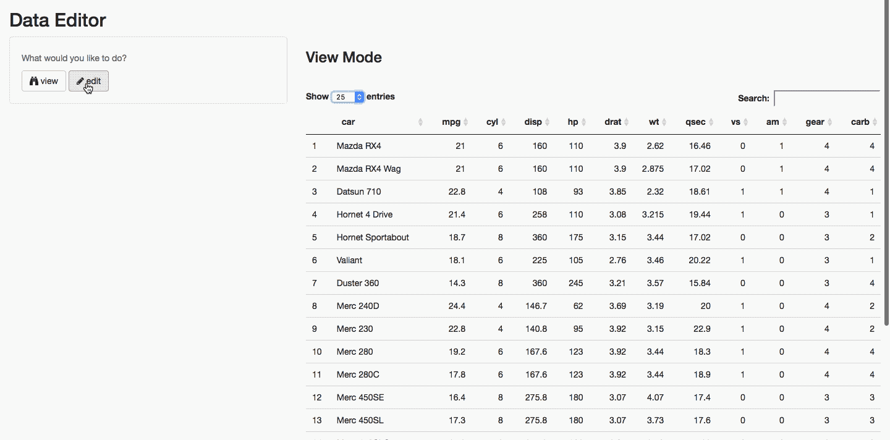

# Shiny Data Editor
---



Read about this app [here](https://davidruvolo51.github.io/projects/shinyapptutorials/tutorials/data-editor.html).

### How can I run this app?

To run this app locally, open up R and paste the following code into the console, and then press enter.

```
shiny::runGitHub(
    username="davidruvolo51",
    repo="shinyAppTutorials",
    subdir = "Data-Editor"
)
```