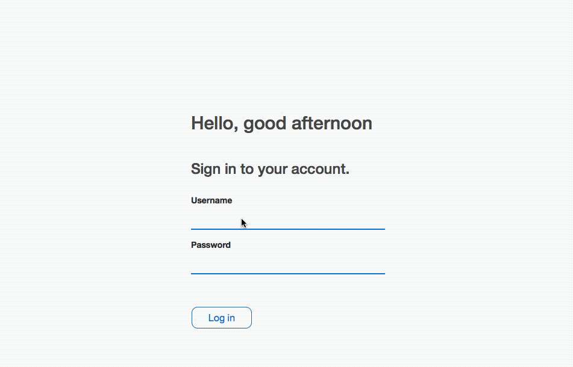

#  Custom Log in screen for shinyapps



Read more about this app [davidruvolo51.github.io/pages/shinytutorials/tutorials/login-screen.html](https://davidruvolo51.github.io/pages/shinytutorials/tutorials/login-screen.html).

### How can I run this app?

To run this app locally, open up R and paste the following code into the console, and then press enter.

```
shiny::runGitHub(
    username="davidruvolo51",
    repo="shinyAppTutorials", 
    subdir = "Login-Screen"
)
```

Test out the app with one of the following accounts.

| type  | Username | password |
| :---: | :---: | :---: |
| standard | user | password |
| standard | test | test |
| admin | admin | admin |

