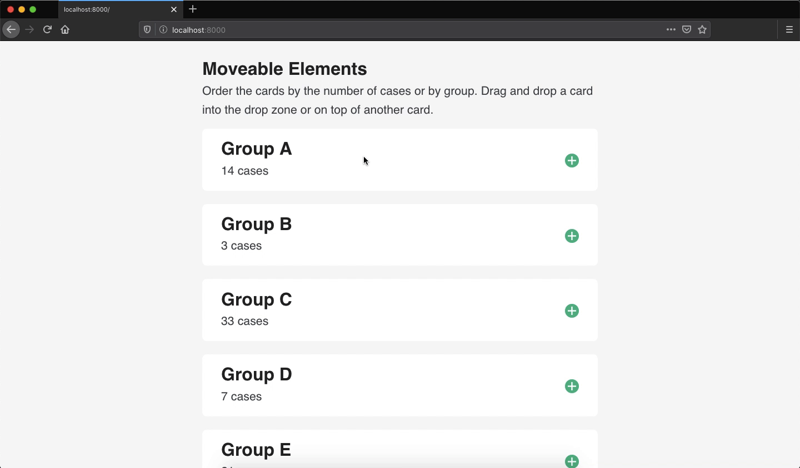

<!-- badges: start -->


<!-- badges: end -->

# Drag and Drop



This shiny app demonstrates how to create a basic drag and drop area in shiny applications using the drag and drop javascript API (native in browsers). There is some logic that highlights dragged elements and potential "drop areas". There is some basic support for determining if the a card should be placed before or after a new card.

You can find more information in the blog post [learn how to create movable elements in shiny apps](https://davidruvolo51.github.io/shinytutorials/tutorials/drag-and-drop/).

## Getting Started

You can run this app locally using the following methods: running within your R environment or cloning this subdirectory.

### Running in your R environment

You can run this app within your R environment using the `runGithub` function. Enter the following command in the console.

```r
shiny::runGitHub(username = "davidruvolo51", repo = "shinyAppTutorials", subdir = "drag-and-drop")
```

### Cloning the subdirectory

You can clone the data editor subdirectory using `git sparse-checkout`.

```bash
git clone --filter=blob:none --sparse https://github.com/davidruvolo51/shinyAppTutorials
cd shinyAppTutorials
git sparse-checkout init --cone
git sparse-checkout set drag-and-drop
```

Then you can run the shiny app in your preferred R environment.
