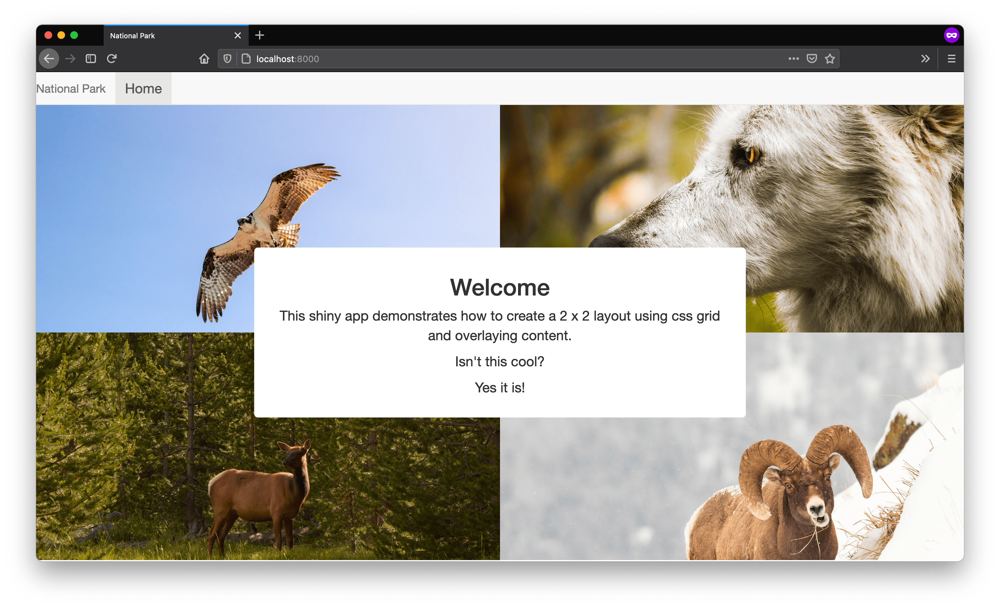

<!-- badges: start -->


<!-- badges: end -->

## Creating a landing page



The purpose of this shiny app is to demonstrate how you could design a landing page in a shiny app where content is placed over a series of images arranged in a `2 x 2` layout. The motivation for this app was to answer this post on the rstudio community: [https://community.rstudio.com/t/background-images-in-shiny/12261](https://community.rstudio.com/t/background-images-in-shiny/12261). Check out longer write up here: [https://davidruvolo51.github.io/pages/shinytutorials/tutorials/landing-page.html](https://davidruvolo51.github.io/pages/shinytutorials/tutorials/landing-page.html).

## Getting Started

You can run this app locally using the following methods: running within your R environment or cloning this subdirectory.

### Running in your R environment

You can run this app within your R environment using the `runGithub` function. Enter the following command in the console.

```r
shiny::runGitHub(username = "davidruvolo51", repo = "shinyAppTutorials", subdir = "shiny-landing-page")
```

### Cloning the subdirectory

You can clone the data editor subdirectory using `git sparse-checkout`.

```bash
git clone --filter=blob:none --sparse https://github.com/davidruvolo51/shinyAppTutorials
cd shinyAppTutorials
git sparse-checkout init --cone
git sparse-checkout set shiny-landing-page
```

Then you can run the shiny app in your preferred R environment.
