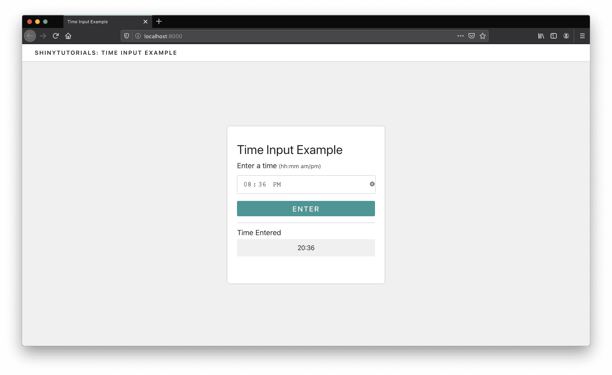

# Time Input

A few months ago, I wrote a blog post on [Creating a custom time input element](https://davidruvolo51.github.io/shinytutorials/tutorials/time-input/) in shiny. Since then, I've started reading the [Advanced R](https://adv-r.hadley.nz) book and started learning about R6 classes. As I was working through the examples, I wondered how these methods could be used in shiny applications, specifically creating custom inputs elements. I decided to recreate the [first example](https://github.com/davidruvolo51/shinyAppTutorials/tree/master/time-input), but with R6 classes instead of JavaScript. 

This example application how to develop custom shiny elements using R6 classes.